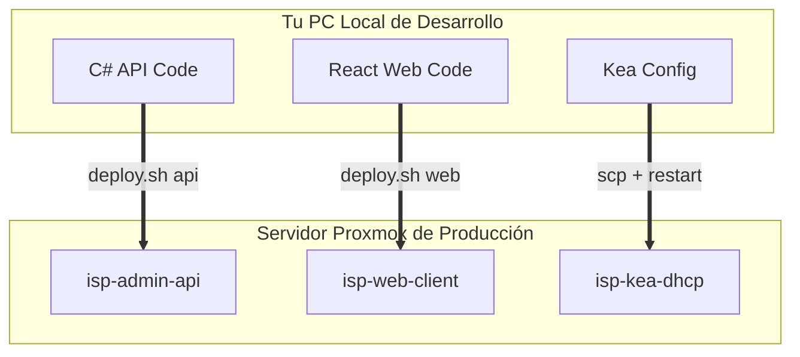

# 🛠️ PLAYBOOK: ACTUALIZACIÓN Y REPARACIÓN INDEPENDIENTE DE SERVICIOS
---
Este manual contiene el procedimiento operativo de SRE para compilar, actualizar y reparar cada uno de los contenedores de **SPI MAS** de forma 100% aislada, garantizando que puedas realizar cambios en caliente sobre un servicio **sin interrumpir o reiniciar los demás**.

---

## 💡 EL CONCEPTO CLAVE DE SRE: El parámetro `--no-deps`

Por defecto, si ejecutas `docker compose up -d`, Docker Compose analiza todo el archivo YAML y puede llegar a reiniciar servicios sanos por precaución. 

Para forzar a Docker a intervenir **únicamente un servicio específico**, utilizamos la bandera `--no-deps` (Sin dependencias):
```bash
# Reconstruye y reinicia SOLO el servicio especificado, dejando el resto intacto
docker compose up -d --build --no-deps <nombre_servicio>
```

---

## 📦 PLAYBOOK POR SERVICIO



---

### 1. ⚙️ `admin-api` (Servicio Backend C# ASP.NET)

* **¿Qué archivos se modifican en desarrollo?**
  * Controladores API: `spi/api/Controllers/*`
  * Servicios de negocio y SNMP: `spi/api/Services/*`
  * Modelos de datos y configuración: `spi/api/Program.cs` o `spi/api/appsettings.json`.
* **Cómo desplegar y actualizar en Producción (Desde PC Local):**
  Solo ejecuta tu comando de actualización específico de API:
  ```bash
  cd ~/Documentos/antigravity/SPI-V1
  ./deploy.sh api
  ```
  *(Este script sincroniza mediante rsync solo la carpeta API y ejecuta de forma aislada la recompilación en el servidor).*
* **Cómo compilar/reparar manualmente en el Servidor (SSH):**
  Si estás dentro del servidor y deseas forzar una reconstrucción limpia de la API:
  ```bash
  cd ~/spi
  docker compose build admin-api
  docker compose up -d --no-deps admin-api
  ```
* **Cómo verificar el correcto funcionamiento:**
  ```bash
  # Ver logs en vivo del backend para descartar errores de compilación
  docker compose logs -f --tail 50 admin-api
  ```

---

### 2. 💻 `web-client` (Servicio Frontend React)

* **¿Qué archivos se modifican en desarrollo?**
  * Pantallas e interfaces: `spi/web/src/views/*`
  * Componentes y estilos: `spi/web/src/components/*` o `spi/web/src/assets/*`.
* **Cómo desplegar y actualizar en Producción (Desde PC Local):**
  Solo ejecuta tu comando de actualización específico de Frontend:
  ```bash
  cd ~/Documentos/antigravity/SPI-V1
  ./deploy.sh web
  ```
* **Cómo compilar/reparar manualmente en el Servidor (SSH):**
  Si deseas recompilar el servidor web estático React directamente en producción:
  ```bash
  cd ~/spi
  docker compose build web-client
  docker compose up -d --no-deps web-client
  ```
* **Cómo verificar el correcto funcionamiento:**
  ```bash
  # Ver el log del servidor web de producción
  docker compose logs -f --tail 50 web-client
  ```

---

### 3. 🌐 `kea-dhcp` (Servidor DHCP Kea)

* **¿Qué archivos se modifican en desarrollo?**
  * Archivo estructural de subredes y tiempos de arriendo: `spi/kea/kea-dhcp4.conf`.
* **Cómo desplegar y actualizar en Producción (Desde PC Local):**
  1. Copia únicamente el archivo de configuración modificado hacia el servidor:
     ```bash
     scp spi/kea/kea-dhcp4.conf usuario@192.168.2.106:~/spi/kea/kea-dhcp4.conf
     ```
  2. Conéctate por SSH al servidor y reinicia el servicio DHCP para que aplique la nueva configuración:
     ```bash
     docker compose restart kea-dhcp
     ```
     *(Este reinicio dura menos de 0.2 segundos, no afecta a las bases de datos ni a la web).*
* **Cómo verificar el correcto funcionamiento:**
  Es crucial revisar que Kea no tenga errores de sintaxis en el archivo JSON. Si hay un error, Kea se detendrá:
  ```bash
  docker compose logs -f --tail 50 kea-dhcp
  ```
  *(Debe decir: `DHCP4_STARTED Kea DHCPv4 server v2.x.x started`)*.

---

### 💾 4. `backup-manager` (Gestor de Respaldos SRE)

* **¿Qué archivos se modifican en desarrollo?**
  * Script Bash de respaldo y simulación de restauración: `spi/backups_system/backup_and_verify.sh`.
* **Cómo desplegar y actualizar en Producción (Desde PC Local):**
  1. Envía el script modificado mediante SCP:
     ```bash
     scp spi/backups_system/backup_and_verify.sh usuario@192.168.2.106:~/spi/backups_system/backup_and_verify.sh
     ```
  2. Conéctate por SSH y dale permisos de ejecución dentro del volumen montado si fuese necesario:
     ```bash
     ssh usuario@192.168.2.106 "chmod +x ~/spi/backups_system/backup_and_verify.sh"
     ```
* **Cómo probar/reparar de forma manual en el Servidor (SSH):**
  Puedes forzar la corrida del script de backups de forma manual dentro del contenedor aislado de resguardos para validar que tu bot de Telegram reciba el reporte verde:
  ```bash
  docker exec -it isp-backup-manager /bin/bash -c "/opt/backups_system/backup_and_verify.sh"
  ```

---

### 🗄️ 5. `postgres` (Base de Datos Activa)

* **¿Qué archivos se modifican?**
  * Variables de entorno y contraseñas secretas en el archivo: `~/spi/.env` (Directo en el servidor).
* **Cómo actualizar en el Servidor (SSH):**
  Si editaste la contraseña de Postgres o configuraciones de IP en el archivo `.env` del servidor:
  ```bash
  cd ~/spi
  # Aplica los cambios del archivo .env de forma aislada sobre la base de datos
  docker compose up -d --no-deps postgres
  ```
* **Cómo verificar el correcto funcionamiento:**
  ```bash
  # Ver estado de conexiones activas en la BD
  docker compose logs -f --tail 50 postgres
  ```
  *(Debe reportar: `database system is ready to accept connections`)*.

---

## 🚑 PROCEDIMIENTO DE EMERGENCIA: Revertir cambios (Rollback)

Si actualizaste la API o la Web en caliente y comenzó a dar errores graves en producción, puedes revertir la versión del contenedor de inmediato en 5 segundos corriendo:

```bash
# 1. Navegar a la carpeta del proyecto en el servidor
cd ~/spi

# 2. Descartar la compilación rota y forzar el reinicio limpio con la última imagen estable anterior
docker compose up -d --force-recreate --no-deps <nombre_servicio>
```
*(Si la falla persiste, puedes hacer un `git checkout` local de tu versión estable anterior en tu PC de desarrollo, correr `./deploy.sh` y en 10 segundos el servidor estará restaurado al 100% de forma limpia)*.
