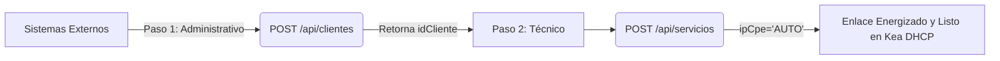

# Guía de Integración de API: Aprovisionamiento de Clientes y Motor Auto-IPAM

Esta guía técnica describe cómo integrar sistemas externos (ERP, CRM o scripts de aprovisionamiento automático) con la API REST de SPI para gestionar el ciclo de vida completo de un abonado: desde su registro comercial y administrativo hasta la activación técnica del enlace mediante DHCP dinámico o direccionamiento estático automatizado.

---

## 🔄 Flujo de Integración de Extremo a Extremo (Abonado Completo)

Para activar el servicio de un nuevo abonado en la red, los sistemas externos de terceros realizan un flujo secuencial sencillo de dos pasos:



---

## 📋 Paso 1: Alta Comercial del Cliente (POST /api/clientes)

Este endpoint registra los metadatos comerciales y de facturación del cliente en la base de datos de SPI. Cuenta con un motor de validación estricto para asegurar que no se carguen datos corruptos o incompletos.

### Solicitud de Ejemplo:
`POST /api/clientes`
```json
{
  "razonSocial": "Distribuidora de Alimentos S.A.",
  "cuitDni": "30-71458963-2",
  "telefono": "+5491155887744",
  "email": "contacto@distribuidora.com.ar",
  "calle": "Av. General Paz",
  "altura": "1250",
  "idLocalidad": 3,
  "codigo": "AB-99201" // Código identificador único del abonado en el sistema de cobros/ERP
}
```

### Reglas de Validación Aplicadas:
1. **Razón Social:** Obligatorio. Debe tener entre 3 y 150 caracteres (se descartan strings genéricos).
2. **CUIT/DNI:** Obligatorio. Soporta DNI (7 u 8 dígitos), CUIT sin guiones (11 dígitos), o CUIT formateado con guiones (`XX-XXXXXXXX-X`). Los puntos de formato son removidos automáticamente.
3. **Email / Teléfono:** Opcionales. Si se proveen, se validan estrictamente mediante expresiones regulares avanzadas.
4. **Código de Abonado:** Obligatorio. Es el campo clave de cruce para sincronizar con los módulos de facturación externos.

### Respuesta Exitosa (`201 Created`):
```json
{
  "id": 18,
  "razonSocial": "Distribuidora de Alimentos S.A.",
  "cuitDni": "30714589632",
  "codigo": "AB-99201",
  "message": "Cliente registrado con éxito en el sistema administrativo."
}
```

---

## 📡 Paso 2: Aprovisionamiento Técnico del Enlace (POST /api/servicios)

Una vez obtenido el `id` (por ejemplo, `18`), el sistema de terceros procede a activar el servicio técnico, vinculando al cliente con un equipo de red, un plan de velocidad y asignándole el direccionamiento IP correspondiente (utilizando el motor Auto-IPAM).

### Payload de la Solicitud:
`POST /api/servicios`
```json
{
  "idCliente": 18,        // ID retornado en el Paso 1
  "idEquipo": 14,         // ID del cablemódem (debe estar en stock 'INVENTARIO')
  "idPaquete": 2,         // ID del plan de internet contratado
  "idCmts": 1,            // ID del CMTS físico al que está conectado
  "ipCm": "AUTO",         // "AUTO" solicita IP estática de gestión automática
  "ipCpe": "AUTO"         // "AUTO" solicita IP estática de navegación comercial
}
```

### Opciones de Direccionamiento IP:

| Modo de Red | Valor en `ipCm` / `ipCpe` | Comportamiento en Red |
| :--- | :--- | :--- |
| **DHCP Dinámico (90% de Clientes)** | `null` (u omitido) | El sistema registra el módem sin IP fija. Kea DHCP le asignará una IP dinámica comercial de forma temporal según su paquete. |
| **Auto-IPAM (Estático Automatizado)** | `"AUTO"` | El backend de SPI busca la primera IP libre en los pools fijos de la subred del CMTS de forma atómica y transaccional, consolidando la IP reservada. |
| **Estático Manual** | `"172.18.110.15"` | El sistema valida que la IP pertenezca a una subred válida del CMTS y la inyecta como IP fija en Kea DHCP de forma explícita. |

### Respuesta Exitosa (`201 Created`):
```json
{
  "id": 105,
  "estado": "ACTIVO",
  "message": "Suscripción activada comercialmente e inyectada en Kea DHCP de forma automática"
}
```
*Al consultar la suscripción `105` en la base de datos o mediante `GET /api/servicios`, verá que los `"AUTO"` han sido resueltos instantáneamente a IPs fijas reales (por ejemplo, `ipCm: "10.20.100.12"` e `ipCpe: "172.18.110.2"`).*

---

## 🛡️ Manejo de Errores y Seguridad Concurrente

La API de SPI utiliza transacciones ACID a nivel de backend y **índices únicos parciales** en PostgreSQL, previniendo carreras de colisiones simultáneas y rechazando IPs duplicadas o mal asignadas.

* **Falta de Stock (`400 Bad Request`):**
  Si el módem (`idEquipo`) ya está en uso por otro cliente activo.
  ```json
  {
    "error": "El equipo con MAC 54d46f196200 no está disponible en inventario. Estado actual: ACTIVO"
  }
  ```

* **Rango IP Completo (`400 Bad Request`):**
  Si se ha consumido la totalidad de las direcciones IPs estáticas de la subred asignada en el CMTS.
  ```json
  {
    "error": "No hay direcciones IP estáticas libres disponibles en los pools reservados para subredes 'CPE' de este CMTS."
  }
  ```

* **Colisión de Unicidad IP (`400 Bad Request`):**
  Si se intenta violar los índices de unicidad parciales inyectando manualmente una IP fija que ya está ocupada por otra suscripción activa.
  ```json
  {
    "error": "Transacción abortada: llave duplicada viola restricción de unicidad 'uq_servicios_clientes_ip_cpe'"
  }
  ```
