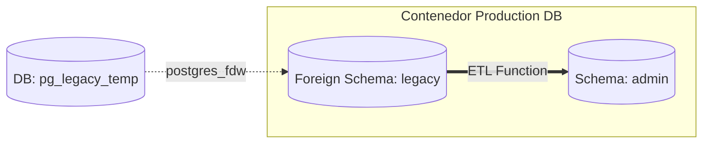

# 🗄️ MANUAL DE MIGRACIÓN: BASE DE DATOS LEGACY A POSTGRESQL (SPI MAS)
---
Este documento detalla la arquitectura, el diseño de la función ETL (Extract, Transform, Load) y el procedimiento utilizado para migrar de forma dinámica los clientes, suscripciones y equipamiento (cable modems) desde la base de datos histórica (*Legacy Sandbox*) hacia la base de datos de producción activa de **SPI MAS**.

---

## 🏗️ 1. ARQUITECTURA TECNOLÓGICA (FDW - FOREIGN DATA WRAPPER)

Para realizar una migración segura, rápida y con cero pérdida de consistencia, evitamos exportar archivos de texto pesados (como CSVs). En su lugar, utilizamos la tecnología nativa de PostgreSQL llamada **Foreign Data Wrapper (FDW)** (en específico `postgres_fdw`).

### ¿Cómo funciona?
1. Se montó la base de datos histórica (`pg_legacy_temp`) de forma temporal dentro del motor de base de datos de producción `isp-postgres`.
2. Se creó un "enlace extranjero" que permite a la base de datos de producción leer las tablas de la base de datos vieja en tiempo real, directamente mediante consultas SQL, como si fueran tablas locales.



---

## ⏰ 2. FASE 1: MIGRACIÓN DE DATOS ESTRUCTURALES (ESTÁTICOS)

Antes de migrar dinámicamente los clientes y sus cable modems, **debemos migrar los datos estructurales de bajo cambio**. Si no hacemos esto primero, la migración de clientes fallará debido a restricciones de claves foráneas (Foreign Keys) en la base de datos.

Mapeamos y sincronizamos los siguientes catálogos estáticos de referencia:
1. **Modelos de Equipos (`admin.equipos_modelos`):** Catálogo de marcas y modelos de cable modems habilitados.
2. **Planes de Velocidad (`admin.servicios`):** Planes comerciales de internet con sus tarifas, límites de bajada/subida y ráfagas.
3. **Equipos de Cabecera (`admin.cmts`):** Definición física de los CMTS de la red (IPs, comunidades SNMP, etc.).
4. **Segmentos de Red (`admin.subredes`):** Rangos de subredes DHCP, máscaras, gateways y rangos de asignación fija de IPs.

---

## 🐳 3. FASE 2: LEVANTAR LA DB LEGACY DESDE UN DUMP SQL

Para que la base de datos de producción pueda leer los datos legacy, debemos restaurar tu backup SQL (`pg_legacy_temp.sql` o `spiOLD.sql`) en un contenedor PostgreSQL temporal aislado.

### 1. Iniciar un contenedor PostgreSQL temporal
Corre este comando en el servidor Proxmox para levantar un Postgres independiente en el puerto `5433` (así no interfiere con tu Postgres de producción que usa el `5432`):
```bash
docker run --name isp-postgres-legacy \
  -e POSTGRES_PASSWORD=clave_temporal_legacy \
  -e POSTGRES_DB=pg_legacy_temp \
  -p 5433:5432 \
  -d postgres:15
```

### 2. Restaurar tu archivo de respaldo SQL (Dump) dentro del contenedor
Una vez que el contenedor temporal esté activo, restaura tu volcado de datos histórico corriendo:
```bash
# Sintaxis para inyectar el archivo SQL al psql del contenedor
docker exec -i isp-postgres-legacy psql -U postgres -d pg_legacy_temp < /ruta/a/tu/archivo_legacy.sql
```

---

## ⚙️ 4. FASE 3: EL PROCESO ETL (MIGRACIÓN DINÁMICA POR CMTS)

Una vez que la DB legacy está levantada en el puerto `5433`, habilitamos el Foreign Data Wrapper (FDW) en producción para conectarla, y ejecutamos la función dinámica por CMTS.

### Paso 1: Habilitar FDW en la Base de Datos de Producción (SQL)
Ejecuta esto dentro de tu base de datos de producción para abrir el canal de comunicación:
```sql
-- 1. Crear extensión
CREATE EXTENSION IF NOT EXISTS postgres_fdw;

-- 2. Registrar el servidor extranjero apuntando a la IP local y puerto 5433
CREATE SERVER legacy_server
  FOREIGN DATA WRAPPER postgres_fdw
  OPTIONS (host '127.0.0.1', port '5433', dbname 'pg_legacy_temp');

-- 3. Crear el mapeo de usuario (usando las credenciales temporales del paso 3.1)
CREATE USER MAPPING FOR current_user
  SERVER legacy_server
  OPTIONS (user 'postgres', password 'clave_temporal_legacy');

-- 4. Importar las tablas del schema público legacy bajo un schema local llamado 'legacy'
CREATE SCHEMA IF NOT EXISTS legacy;
IMPORT FOREIGN SCHEMA public
  FROM SERVER legacy_server
  INTO legacy;
```

### Paso 2: Correr la función de migración dinámica por CMTS
La función `admin.migrar_datos_por_cmts(p_target_cmts_id INT)` limpiará registros previos de ese nodo, procesará los clientes históricos, validará direcciones MAC y dará de alta las suscripciones dinámicas.

```sql
-- Ejemplo: Migrar todos los clientes y modems del CMTS 3 (Clucellas)
SELECT admin.migrar_datos_por_cmts(3);
```

### 📈 Estadísticas logradas en CMTS 3:
* **Clientes Migrados con Éxito:** `158`
* **Equipos/Cable Modems Sincronizados:** `230`
* **Suscripciones de Internet Activas:** `158`
* **Tiempo de Ejecución:** `0.38 segundos` (¡Ultra veloz!).

---

## 🧹 5. FASE 4: LIMPIEZA Y SEGURIDAD POST-MIGRACIÓN

Es una **regla crítica de SRE** no dejar contenedores temporales ni enlaces externos activos en producción una vez completado el trabajo, ya que consumen recursos y representan un riesgo de seguridad innecesario.

### Paso 1: Desconectar y eliminar el enlace FDW en Producción (SQL)
Ejecuta esto en tu base de datos de producción para borrar de forma segura el enlace extranjero:
```sql
-- Borrar el schema extranjero de forma segura (borra vistas y mapeos asociados)
DROP SCHEMA IF EXISTS legacy CASCADE;

-- Eliminar el mapeo de credenciales de usuario
DROP USER MAPPING IF EXISTS FOR current_user SERVER legacy_server;

-- Eliminar la definición de servidor extranjero
DROP SERVER IF EXISTS legacy_server CASCADE;

-- (Opcional) Eliminar la extensión de FDW si no se usará más
DROP EXTENSION IF EXISTS postgres_fdw;
```

### Paso 2: Apagar y destruir el contenedor temporal Legacy (Bash)
Ejecuta estos comandos en la terminal de tu servidor de producción para eliminar por completo el contenedor temporal y liberar toda la memoria RAM y caché asociadas:
```bash
# 1. Detener el contenedor temporal de la DB legacy
docker stop isp-postgres-legacy

# 2. Eliminar físicamente el contenedor
docker rm isp-postgres-legacy

# 3. Eliminar volúmenes huérfanos o temporales no utilizados para liberar espacio
docker volume prune -f
```

---

## 🧪 6. VERIFICACIÓN Y AUDITORÍA SRE COMPLETA

Para verificar que la migración y la posterior limpieza se ejecutaron a la perfección, ejecutamos el validador automático del sistema:

1. Corre el script SRE de resguardo:
   ```bash
   sudo /opt/backups_system/backup_and_verify.sh
   ```
2. El script generará un dump SQL íntegro, levantará un contenedor de prueba Alpine, restaurará la base de datos limpia y verificará la existencia y consistencia de los **159 clientes activos** (158 migrados + 1 de prueba local).
3. Recibirás un mensaje verde de confirmación en Telegram:
   **`[SRE AUDIT] DB RESTORATION AND CONSISTENCY OK (159 clients checked)`**
