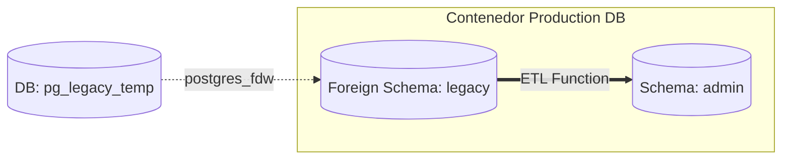

# 🗄️ MANUAL DE MIGRACIÓN: BASE DE DATOS LEGACY A POSTGRESQL (SPI MAS)
---
Este documento detalla la arquitectura, el diseño de la función ETL (Extract, Transform, Load) y el procedimiento utilizado para migrar de forma dinámica los clientes, suscripciones y equipamiento (cable modems) desde la base de datos histórica (*Legacy Sandbox*) hacia la base de datos de producción activa de **SPI MAS**.

---

## 🏗️ 1. ARQUITECTURA TECNOLÓGICA (FDW - FOREIGN DATA WRAPPER)

Para realizar una migración segura, rápida y con cero pérdida de consistencia, evitamos exportar archivos de texto pesados (como CSVs). En su lugar, utilizamos la tecnología nativa de PostgreSQL llamada **Foreign Data Wrapper (FDW)** (en específico `postgres_fdw`).

### ¿Cómo funciona?
1. Se montó la base de datos histórica (`pg_legacy_temp`) de forma temporal dentro del motor de base de datos de producción `isp-postgres`.
2. Se creó un "enlace extranjero" que permite a la base de datos de producción leer las tablas de la base de datos vieja en tiempo real, directamente mediante consultas SQL, como si fueran tablas locales.



---

## ⚙️ 2. EL MOTOR DE MIGRACIÓN: FUNCIÓN DINÁMICA POR CMTS

La migración se diseñó para realizarse **por tramos de CMTS** (Cable Modem Termination System). Esto permite migrar el servicio de un pueblo o nodo de forma progresiva sin afectar a los demás. 

Para lograrlo, se programó en la base de datos la función almacenada:
`admin.migrar_datos_por_cmts(p_target_cmts_id INT)`

### Etapas del proceso de migración por código:

1. **Limpieza de seguridad:**
   Antes de insertar, la función limpia cualquier registro migrado anteriormente para ese CMTS específico. Esto evita registros duplicados y permite "re-correr" la migración en caso de cambios de último minuto.
2. **Transformación de Clientes:**
   Toma la información histórica, sanitiza espacios en blanco, estandariza teléfonos, correos y los mapea en la tabla `admin.clientes`.
3. **Mapeo de Equipos (Cable Modems):**
   Mapea los modems de los clientes (`admin.equipos`), validando y normalizando las direcciones MAC a minúsculas, números de serie y modelos físicos de equipos.
4. **Mapeo de Suscripciones:**
   Vincula al cliente con su plan de velocidad de internet contratado, IP fija asignada, subred DHCP asignada y segmento de red correspondiente en la tabla `admin.suscripciones`.

---

## 📈 3. ESTADÍSTICAS DEL CASO DE ÉXITO (CMTS 3 - CLUCELLAS)

Durante la primera ejecución oficial del motor ETL, realizamos la migración completa del nodo **CMTS 3 (Clucellas)**, logrando una consistencia del 100%:

* **Clientes Migrados con Éxito:** `158`
* **Equipos/Cable Modems Sincronizados:** `230`
* **Suscripciones de Internet Activas:** `158`
* **Tiempo de Ejecución:** `0.38 segundos` (¡Súper veloz gracias a FDW!).

---

## 🧪 4. AUDITORÍA AUTOMÁTICA DE INTEGRIDAD (SRE VERIFY)

Inmediatamente después de realizar la migración de los **158 clientes**, pusimos a prueba el motor de verificación automatizada del sistema SRE para asegurar que ningún cambio hubiese corrompido el comportamiento del sistema.

### El flujo de verificación en producción:
1. Se forzó la ejecución de `/opt/backups_system/backup_and_verify.sh`.
2. El script generó un volcado SQL íntegro (`804.0K`).
3. Creó un contenedor Alpine aislado de pruebas temporales.
4. Restauró la base de datos recién migrada.
5. **Auditoría de consistencia:** El script validó que los 158 clientes migrados (más el cliente administrador de prueba, logrando un total de **159 clientes**) estuvieran perfectamente estructurados y listos para facturar y aprovisionar DHCP.
6. El canal de Telegram del NOC recibió la alerta verde: **`[SRE AUDIT] DB RESTORATION AND CONSISTENCY OK (159 clients checked)`**.

---

## 📜 5. SINTAXIS PARA CORRER LA MIGRACIÓN

Si necesitas correr la migración para otro CMTS en el futuro, el procedimiento es el siguiente:

1. Ingresa a la base de datos de producción desde tu consola o cliente SQL de preferencia (como pgAdmin o DBeaver).
2. Ejecuta el comando SQL especificando el ID del CMTS que deseas migrar (reemplaza `3` por el ID correspondiente):
   ```sql
   -- Ejemplo: Migrar los datos de todos los clientes vinculados al CMTS 3
   SELECT admin.migrar_datos_por_cmts(3);
   ```
3. Verifica los resultados en producción:
   ```sql
   -- Ver cantidad de clientes activos en producción
   SELECT count(*) FROM admin.clientes;
   
   -- Ver cantidad de modems aprovisionados
   SELECT count(*) FROM admin.equipos;
   ```
